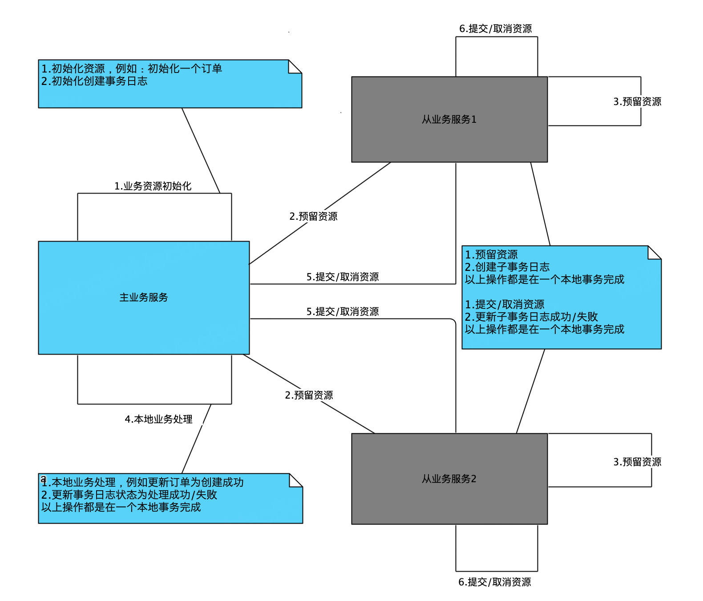

## TCC

tcc框架用于解决分布式场景多服务间的事务问题，该框架不建立在dubbo、http 、grpc等基础协议上层，服务可以任意选择暴露的协议，

只要遵循Try 、Commit、 Cancel规范即可。已解决悬挂、幂等、空回滚、事务嵌套问题，业务层面无需关注这部分处理。

**tcc分为以下几个阶段：**

1. 执行前置动作 (业务资源的初始化，例如: 创建一个初始化的订单)
2. Try  (调用外部服务，进行资源的预留)
3. 执行本地事务  (需要保证业务是在一个事务内完成)
4. Commit\Cancel  (根据本地事务的执行的成功与否，进行commit || cancel)



## 示例

该示例主要用于用户下单的同时，需要扣减用户积分的场景，订单服务和积分服务分别是独立服务部署，它们之间存在分布式事务的问题，
我们通过当前框架展示是如何解决以上问题的。

<https://github.com/654894017/tcc/tree/master/src/test/java/com/damon/sample>

步骤1.初始化订单服务数据库表

```roomsql
-- 创建事务表
CREATE TABLE `tcc_main_log_order` (
  `biz_id` bigint NOT NULL COMMENT '业务id',
  `status` int NOT NULL DEFAULT '0' COMMENT '状态: 1 创建事务成功 2  回滚成功  3 完成本地事务成功  4 提交事务成功',
  `version` int NOT NULL DEFAULT '0' COMMENT '版本号',
  `last_update_time` bigint NOT NULL DEFAULT '0' COMMENT '最后更新时间',
  `create_time` bigint NOT NULL DEFAULT '0' COMMENT '创建时间',
  `checked_times` int NOT NULL DEFAULT '0' COMMENT '失败检查次数',
  PRIMARY KEY (`biz_id`),
  KEY `idx_status_checked_times_create_time` (`status`,`checked_times`,`create_time`)
) ENGINE=InnoDB DEFAULT CHARSET=utf8mb4 COLLATE=utf8mb4_bin COMMENT='主事务日志表';

-- 创建订单表
CREATE TABLE `tcc_demo_order` (
  `order_id` bigint NOT NULL,
  `status` int NOT NULL,
  `user_id` bigint NOT NULL,
  `deduction_points` bigint DEFAULT NULL,
  PRIMARY KEY (`order_id`) USING BTREE
) ENGINE=InnoDB DEFAULT CHARSET=utf8mb4 COLLATE=utf8mb4_bin;
```

步骤2.积分服务创建子事务表

```roomsql
-- 创建子事务表
CREATE TABLE `tcc_sub_log_order` (
  `biz_id` bigint NOT NULL COMMENT '业务id',
  `sub_biz_id` bigint NOT NULL DEFAULT '0' COMMENT '子业务id',
  `status` int NOT NULL DEFAULT '0' COMMENT '状态: 1 创建事务成功 2  提交事务成功  3 回滚事务成功',
  `version` int NOT NULL DEFAULT '0' COMMENT '版本号',
  `last_update_time` bigint NOT NULL DEFAULT '0' COMMENT '最后更新时间',
  `create_time` bigint NOT NULL DEFAULT '0' COMMENT '创建时间',
  PRIMARY KEY (`biz_id`,`sub_biz_id`) USING BTREE
) ENGINE=InnoDB DEFAULT CHARSET=utf8mb4 COLLATE=utf8mb4_bin COMMENT='子事务日志表';

-- 创建积分变动日志表
CREATE TABLE `tcc_demo_points_changing_log` (
  `biz_id` bigint NOT NULL,
  `user_id` bigint NOT NULL,
  `change_points` bigint NOT NULL,
  `change_type` int NOT NULL,
  `status` int NOT NULL,
  PRIMARY KEY (`biz_id`) USING BTREE
) ENGINE=InnoDB DEFAULT CHARSET=utf8mb4 COLLATE=utf8mb4_bin;

-- 创建用户积分表
CREATE TABLE `tcc_demo_user_points` (
  `user_id` bigint NOT NULL,
  `points` bigint NOT NULL,
  PRIMARY KEY (`user_id`) USING BTREE
) ENGINE=InnoDB DEFAULT CHARSET=utf8mb4 COLLATE=utf8mb4_bin;

-- 初始化用户积分
INSERT INTO `tcc_demo_user_points` (`user_id`, `points`) VALUES (12345678, 999999999989989999);
```

### 注意事项

事务表都是以`tcc_main_log_xxxx` 命名,子事务表都是以`tcc_sub_log_xxxx`命名,`xxxx`为业务分类,例如订单下单的业务,事务表命名为`tcc_main_log_order`, 子事务表命名为`tcc_sub_log_order`.

步骤3.运行 com.damon.sample.points.PointsApplication

步骤4.运行 com.damon.sample.order.TestRun

### 下单服务

下单服务继承TccMainService服务

```java
package com.damon.sample.order.app;

import cn.hutool.core.util.IdUtil;
import com.damon.sample.order.client.IOrderSubmitAppService;
import com.damon.sample.order.domain.IPointsGateway;
import com.damon.sample.order.domain.Order;
import com.damon.tcc.config.TccMainConfig;
import com.damon.tcc.TccMainService;
import org.springframework.beans.factory.annotation.Autowired;
import org.springframework.jdbc.core.BeanPropertyRowMapper;
import org.springframework.jdbc.core.JdbcTemplate;
import org.springframework.stereotype.Service;

import java.util.HashMap;
import java.util.Map;

@Service
public class OrderSubmitAppService extends TccMainService<Long, Map<String, Boolean>, Order> implements IOrderSubmitAppService {
    private final JdbcTemplate jdbcTemplate;
    private final IPointsGateway pointsGateway;

    @Autowired
    public OrderSubmitAppService(TccMainConfig config, IPointsGateway pointsGateway) {
        super(config);
        this.jdbcTemplate = new JdbcTemplate(config.getDataSource());
        this.pointsGateway = pointsGateway;
    }

    /**
     * 检查失败的日志，校正事务是否需要回滚还是提交
     */
    public void executeFailedLogCheck() {
        super.executeFailedLogCheck();
    }

    /**
     * 检查死亡的日志，校正事务是否需要回滚还是提交
     */
    public void executeDeadLogCheck() {
        super.executeDeadLogCheck();
    }

    /**
     * 执行失败日志检查的时候需要回查请求参数（因为事务日志未记录方法请求参数，所以需要回查一下）
     * @param bizId 实体对象id（业务id）
     * @return
     */
    @Override
    protected Order callbackParameter(Long bizId) {
        return jdbcTemplate.queryForObject("select * from tcc_demo_order where order_id = ? ", new BeanPropertyRowMapper<>(Order.class), bizId);
    }

    /**
     * 创建订单 （1 预先创建订单  2 执行try动作）
     *
     * @param userId
     * @param points
     * @return
     */
    @Override
    public Long submitOrder(Long userId, Long points) {
        Long orderId = IdUtil.getSnowflakeNextId();
        jdbcTemplate.update("insert into tcc_demo_order(order_id, user_id, status, deduction_points) values (?, ?, ? ,? )", orderId, userId, 0, points);
        Order order = new Order(orderId, 0, userId, points);
        try {
            return super.process(order);
        } catch (RuntimeException e) {
            // try  localTransaction  commit  cancel 错误可以通过自定义异常抛出
            throw e;
        } catch (Exception e) {
            throw new RuntimeException("系统异常");
        }
    }

    /**
     * try执行用户积分扣除
     *
     * @param order
     * @return
     */
    @Override
    protected Map<String, Boolean> attempt(Order order) {
        Boolean result = pointsGateway.tryDeductionPoints(order.getOrderId(), order.getUserId(), order.getDeductionPoints());
        Map<String, Boolean> map = new HashMap<>();
        map.put("flag", result);
        return map;
    }

    @Override
    protected Long executeLocalTransaction(Order object, Map<String, Boolean> map) {
        int result = jdbcTemplate.update("update tcc_demo_order set status = ?  where order_id = ? ", 1, object.getOrderId());
        if (result == 0) {
            throw new RuntimeException("无效的订单id : " + object.getOrderId());
        }
        return object.getOrderId();
    }

    /**
     * commit积分
     *
     * @param order
     */
    @Override
    protected void commit(Order order) {
        pointsGateway.commitDeductionPoints(order.getOrderId(), order.getUserId(), order.getDeductionPoints());
    }

    /**
     * cancel回滚积分
     *
     * @param order
     */
    @Override
    protected void cancel(Order order) {
        pointsGateway.cancelDeductionPoints(order.getOrderId(), order.getUserId(), order.getDeductionPoints());
    }
}

```

### 积分服务

积分服务继承TccSubService服务

```java
package com.damon.sample.points.app;

import com.damon.sample.points.client.IPointsDeductionAppService;
import com.damon.sample.points.client.PointsDeductCmd;
import com.damon.tcc.config.TccSubConfig;
import com.damon.tcc.TccSubService;
import org.slf4j.Logger;
import org.slf4j.LoggerFactory;
import org.springframework.beans.factory.annotation.Autowired;
import org.springframework.jdbc.core.JdbcTemplate;
import org.springframework.stereotype.Service;
import org.springframework.transaction.support.TransactionSynchronizationManager;

@Service
public class PointsDeductionAppService extends TccSubService<Boolean, PointsDeductCmd> implements IPointsDeductionAppService {
    private final Logger log = LoggerFactory.getLogger(PointsDeductionAppService.class);
    private final JdbcTemplate jdbcTemplate;

    @Autowired
    public PointsDeductionAppService(TccSubConfig config) {
        super(config);
        this.jdbcTemplate = new JdbcTemplate(config.getDataSource());
    }

    /**
     * try执行积分扣减
     * @param parameter
     * @return
     */
    @Override
    public boolean attempt(PointsDeductCmd parameter) {
        return super.prepare(parameter, cmd -> {
            int result = jdbcTemplate.update("update tcc_demo_user_points set points = points - ? where user_id = ? and points - ? >= 0",
                    cmd.getDeductionPoints(), cmd.getUserId(), cmd.getDeductionPoints());
            boolean transactionActive = TransactionSynchronizationManager.isActualTransactionActive();

            if (result == 0) {
                throw new RuntimeException("用户积分不足 || 用户不存在");
            }

            int result2 = jdbcTemplate.update("insert tcc_demo_points_changing_Log (user_id, change_points, change_type, biz_id, status) values(?,?,?,?,?)",
                    cmd.getUserId(), cmd.getDeductionPoints(), 1, cmd.getOrderId(), 0);

            return true;
        });
    }

    /**
     * commit提交积分扣减
     * @param parameter
     */
    @Override
    public void commit(PointsDeductCmd parameter) {
        super.commit(parameter, cmd -> {
            int result = jdbcTemplate.update("update tcc_demo_points_changing_Log set status = 1 where biz_id = ?", cmd.getBizId());
            if (result == 0) {
                throw new RuntimeException("无效的业务id，无法积分commit");
            }
        });
    }

    /**
     * cancel回滚积分扣减
     * @param parameter
     */
    @Override
    public void cancel(PointsDeductCmd parameter) {
        super.cancel(parameter, cmd -> {
            int result = jdbcTemplate.update("update tcc_demo_points_changing_Log set status = 2 where biz_id = ?", cmd.getBizId());
            if (result == 0) {
                log.error("无效的业务id : {}，无法进行积分cancel", cmd.getBizId());
                return;
            }

            int result2 = jdbcTemplate.update("update tcc_demo_user_points set points = points + ? where user_id = ?",
                    cmd.getDeductionPoints(), cmd.getUserId()
            );
            if (result2 == 0) {
                throw new RuntimeException("无效的用户id，无法进行积分rollback");
            }
        });
    }


}

```


